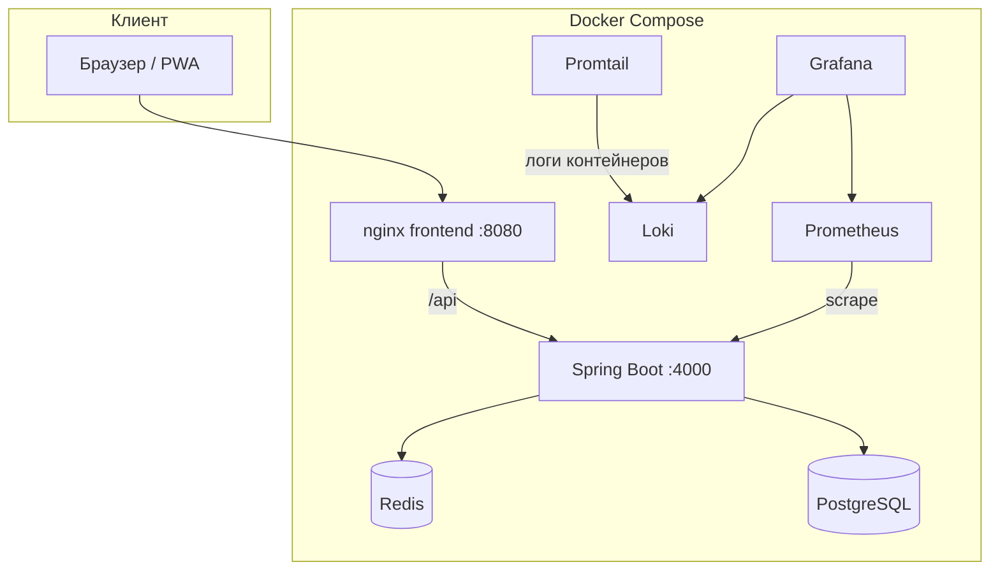

# Карта репозитория Rehab / Rehub

Документ для быстрой навигации по монорепозиторию: что за чем лежит и куда идти за типичными задачами.

---

## С чего начать

| Задача | Где |
|--------|-----|
| Поднять весь стек локально | Корень: [`Makefile`](../Makefile) (`make`), [`docker-compose.yml`](../docker-compose.yml) |
| Описание портов и сервисов Docker | [README.md — раздел Docker](../README.md) |
| Контракт REST API | [api.md](./api.md) |
| Бизнес-логика (EN / RU) | [business-en.md](./business-en.md), [business-ru.md](./business-ru.md) |
| Схема БД и миграции Prisma | [`db/prisma/schema.prisma`](../db/prisma/schema.prisma) |
| Kotlin API, кеш, тесты | [`backend/README.md`](../backend/README.md) |
| UI E2E (Playwright) | [`app/playwright.config.ts`](../app/playwright.config.ts), [`app/e2e/`](../app/e2e/) |
| Метрики и логи в Docker | [`monitoring/`](../monitoring/) |

---

## Корень репозитория

```
rehab/
├── app/                    # React + Vite (PWA)
├── backend/                # Kotlin + Spring Boot API
├── db/                     # Prisma: схема и миграции PostgreSQL
├── docs/                   # Документация (API, бизнес, эта карта)
├── monitoring/             # Prometheus, Loki, Grafana, Promtail
├── docker-compose.yml      # Полный стек для разработки/демо
├── Makefile                # Обёртка над docker compose (up, down, e2e, …)
└── README.md               # Точка входа: стек, запуск, Docker, E2E
```

---

## Frontend — `app/`

| Путь | Назначение |
|------|------------|
| `src/App.jsx` | Корень SPA: навигация, загрузка данных по дому, маршрутизация «экранов» |
| `src/Login.jsx` | Авторизация |
| `src/pages/` | Экраны (пациенты, группы, финансы, смены, …) |
| `src/components/ui/` | Переиспользуемые UI-примитивы (кнопки, модалки, таблицы) |
| `src/lib/api.js` | `fetch`, JWT, `authFetch` |
| `src/data/` | Константы навигации, лимиты валидации, тема |
| `src/hooks/` | `useToast`, `useBreakpoint`, … |
| `vite.config.js` | Dev-сервер, прокси `/api` → backend |
| `e2e/` | Playwright: логин, навигация, формы |
| `playwright.config.ts` | Базовый URL, webServer Vite, `serviceWorkers: 'block'` |

Сборка продакшена: `npm run build` → статика для nginx в Docker.

---

## Backend — `backend/`

| Путь | Назначение |
|------|------------|
| `build.gradle.kts`, `settings.gradle.kts` | Gradle, зависимости, wrapper |
| `src/main/resources/application.yml` | Базовые настройки (порт, JPA, Caffeine, health) |
| `src/main/resources/application-docker.yml` | Профиль `docker`: Redis, кеш tiered, Prometheus |
| `src/test/resources/application-test.yml` | Профиль `test`: без Redis, Hibernate `create-drop` |

### Пакеты Kotlin — `com.rehabcenter.*`

| Пакет | Содержимое |
|-------|------------|
| `web/` | REST-контроллеры (`*Controller.kt`), маршруты `/api/...` |
| `repo/` | Spring Data JPA репозитории |
| `domain/` | Сущности Hibernate (`PatientGraph.kt` и др.), доменные модели |
| `config/` | Security, кеш (Caffeine / Redis+tiered), JWT props, фильтры, exception handlers |
| `security/` | JWT фильтр, сервис токенов |
| `service/` | Сервисный слой поверх репозиториев (напр. кеш + retry для домов) |
| `bootstrap/` | Демо-сид (`RehabDemoSeeder`) |
| `validation/` | Общие ограничения UI/API (`UiValidation`) |
| `error/` | Бизнес-исключения API (`ApiBusinessException`) |
| `RehabApplication.kt` | Точка входа Spring Boot |

Тесты: `src/test/kotlin/com/rehabcenter/it/` — интеграционные с Testcontainers; `testsupport/` — фикстуры и базовый класс.

---

## База данных — `db/`

- `prisma/schema.prisma` — источник правды по таблицам для Prisma и ориентир для JPA-сущностей в backend.
- Миграции и скрипты npm — см. README в корне и в `db/` при наличии.

---

## Наблюдаемость — `monitoring/`

| Путь | Назначение |
|------|------------|
| `prometheus/prometheus.yml` | Scrape API (`/actuator/prometheus`) |
| `loki/`, `promtail/` | Логи контейнеров |
| `grafana/provisioning/` | Datasources и дашборды |

---

## Высокоуровневая схема потоков



---

## Соглашения

- **Имена Docker-образов** приложения: см. `image:` в `docker-compose.yml` (`rehub/rehab-*:local`).
- **Профили Spring**: без профиля — локальная разработка; `docker` — compose; `test` — автотесты.
- **Кеш `houses`**: локально Caffeine; в Docker — Redis с in-process fallback (см. `DockerTieredCacheConfiguration` в backend).

При изменении структуры каталогов обновите этот файл и блок **Project Structure** в корневом `README.md`.
